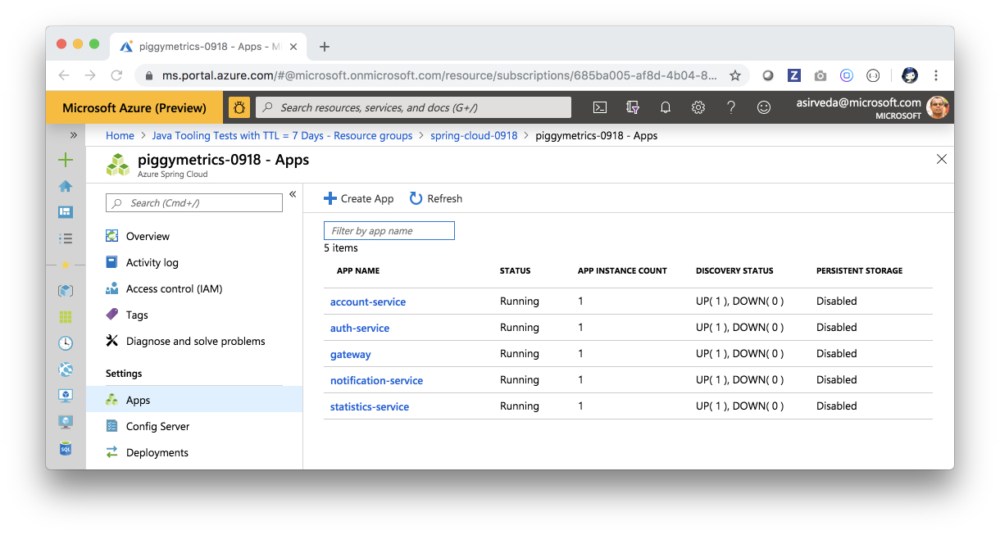
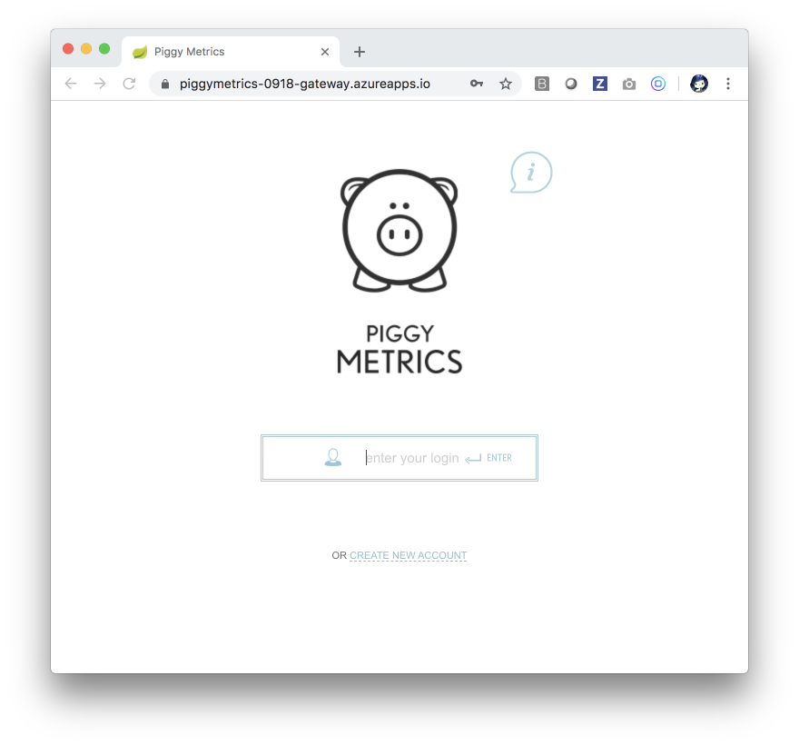
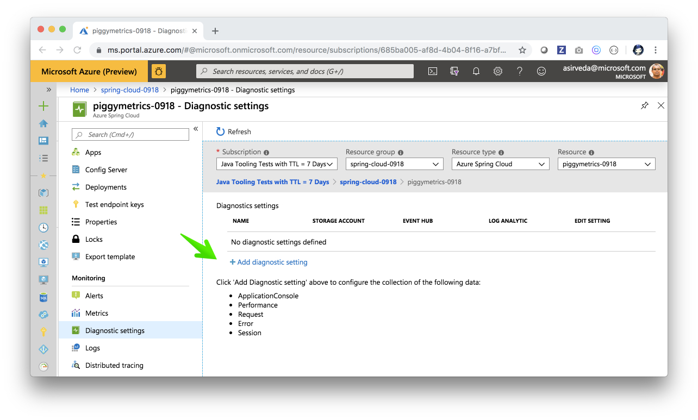
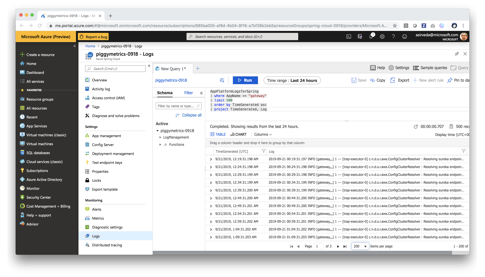
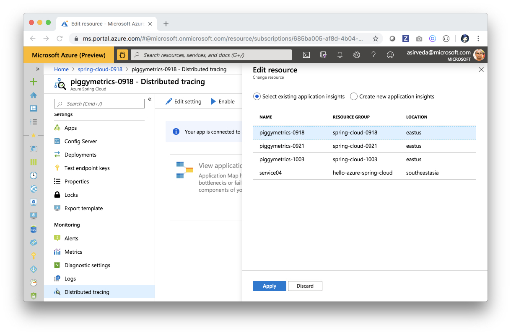
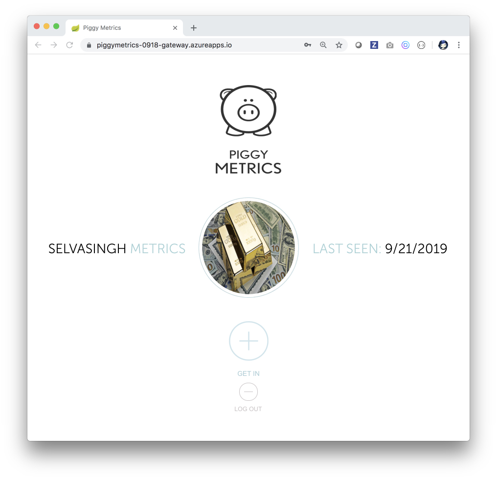

# End-to-end experience - Azure Spring Cloud

This guide walks you through how to deploy and manage Spring Cloud micro services on Azure.

<!--

## Editor's checklist
- What will you experience (DONE)
- What you will need (DONE)
- Start here (DONE)
- Build Piggymetrics - Spring Cloud micro service apps (DONE)
- Create Mongodb and RabbitMQ
- Run Piggymetrics locally 
- Create Azure Spring Cloud (DONE)
- Deploy Piggymetrics to Azure Spring Cloud (DONE)
- Bind micro service apps to Azure Cosmos DB - MongoDB (DONE)
- Troubleshooting micro service apps in Azure Spring Cloud (DONE)
- Rapidly deploy changes to Azure Spring Cloud without disruption - blue-green deployments (DONE)
- Scale up micro service apps in Azure Spring Cloud
- Congratulations!
- Resources

-->


## What will you experience

You will:
- Build Piggymetrics - build a proof-of-concept application, which demonstrates 
micro service architecture pattern using Spring Boot and Spring Cloud
- Create Mongodb and RabbitMQ on Azure
- Run Piggymetrics locally
- Create Azure Spring Cloud
- Deploy Piggymetrics to Azure Spring Cloud
- Bind micro service apps to Azure Cosmos DB - MongoDB
- Troubleshoot micro service apps in Azure Spring Cloud
- Rapidly deploy changes to Azure Spring Cloud without any disruption - blue-green deployments
- Scale out micro service apps in Azure Spring Cloud

## What you will need

In order to deploy a Java Web app to cloud, you need 
an Azure subscription. If you do not already have an Azure 
subscription, you can activate your 
[MSDN subscriber benefits](https://azure.microsoft.com/pricing/member-offers/msdn-benefits-details/) 
or sign up for a 
[free Azure account]((https://azure.microsoft.com/pricing/free-trial/)).

In addition, you will need the following:

| [Azure CLI](http://docs.microsoft.com/cli/azure/overview) 
| [Java 8](https://www.azul.com/downloads/azure-only/zulu) 
| [Maven 3](http://maven.apache.org/) 
| [Git](https://github.com/) 
| 

If you have not yet signed up for the Azure Spring Cloud private 
preview, please sign up by providing your contact details at:
[https://aka.ms/spring-cloud](https://aka.ms/spring-cloud).

## IMPORTANT - Start Here

Clone this GitHub repo and prep:
```bash
git clone --recurse-submodules https://github.com/Azure-Samples/azure-spring-cloud.git

cd azure-spring-cloud

yes | cp -rf .prep/* .
```

## Build Piggymetrics - Spring Cloud micro service apps

Build Piggymetrics:
```bash

cd piggymetrics

mvn clean package -DskipTests -Denv=development
```

## Create MongoDB and RabbitMQ

You can create MongoDB and RabbitMQ on Azure by following steps outlined [here](./docs/create-mongodb-and-rabbitmq.md)
and capture MongoDB and RabbitMQ coordinates and credentials in 
`setup-env-variables-development.sh` 
and `setup-env-variables-azure.sh`. 

## Run Piggymetrics locally

You can use multiple console terminals and start micro service apps - see 
[how to run Piggymetrics locally](./docs/run-piggymetrics-locally.md) ...

## Create Azure Spring Cloud

### Install the Azure Spring Cloud extension

```bash
# Login to Azure, if not already logged in
az login

# Install Azure Spring Cloud CLI extension
az extension add spring-cloud
```

### Create Azure Spring Cloud

Prep the dev environment by populating environment variables in 
`piggymetrics/.scripts/setup-env-variables-azure.sh`
bash script:

```bash
# ====== Piggy Metrics Azure Coordinates
export RESOURCE_GROUP=INSERT-your-resource-group-name
export REGION=eastus
export SPRING_CLOUD_SERVICE=INSERT-your-spring-cloud-service-name

## ===== Mongo DB
export MONGODB_DATABASE=INSERT-your-mongodb-database-name
export MONGODB_USER=INSERT-your-cosmosdb-account-name
export MONGODB_URI="INSERT-your-mongodb-connection-string"
export MONGODB_RESOURCE_ID=INSERT-your-mongodb-resource-id

## ===== Rabbit MQ
export RABBITMQ_RESOURCE_GROUP=INSERT-your-rabbitmq-resource-group-name
export VM_NAME=INSERT-your-rabbitmq-virtual-machine-name
export ADMIN_USERNAME=INSERT-your-rabbitmq-admin-user-name

# Rabbit MQ
export RABBITMQ_HOST=INSERT-your-rabbitmq-host-public-ip-address
export RABBITMQ_PORT=5672
export RABBITMQ_USERNAME=INSERT-your-rabbitmq-username
export RABBITMQ_PASSWORD=INSERT-your-rabbitmq-password
```

Then, export these environment variables from the `
azure-spring-cloud/piggymetrics` directory:

```bash
cd piggymetrics

source .scripts/setup-env-variables-azure.sh
```

Create an Azure Spring Cloud service instance using Azure CLI:
```bash
# Create a Resource Group, if you have not created one
az group create --name ${RESOURCE_GROUP} \
    --location ${REGION}
    
# Create Azure Spring Cloud
az spring-cloud create --name ${SPRING_CLOUD_SERVICE} \
    --resource-group ${RESOURCE_GROUP} \
    --location ${REGION}
```

### Configure defaults in your development machine

You can set defaults so that you do not have to repeatedly mention 
resource group, location and service name in your subsequent calls to 
Azure Spring Cloud:
```bash
# Configure defaults
az configure --defaults \
    group=${RESOURCE_GROUP} \
    location=${REGION} \
    spring-cloud=${SPRING_CLOUD_SERVICE}​
```

## Deploy Piggymetrics to Azure Spring Cloud

### Load Spring Cloud Config Server

A Piggymetrics config repo is in the Microsoft GitHub Organization. 
`application.yml` file in the `Piggymetrics` directory carries coordinates
for this repo.

```yaml
# Contents of application.yml
spring:
  cloud:
    config:
      server:
        git:
          uri: https://github.com/microsoft/piggymetrics-config.git
```

You can load config from this GitHub repo:
```bash
az spring-cloud config-server set \
    --config-file application.yml \
    --name ${SPRING_CLOUD_SERVICE}
```

### Create first set of apps
You can create apps in the Azure Spring Cloud service instance:
```bash
# Create the first app
az spring-cloud app create --name gateway --instance-count 1 --is-public true
```

Note down the publicly accessible URL for the gateway app. It is the URL for 
reaching the Piggymetrics app, for example, see the value of "url" below:
```json
{
  "id": "/subscriptions/685ba005-af8d-4b04-8f16-a7bf38b2eb5a/resourceGroups/spring-cloud-0918/providers/Microsoft.AppPlatform/Spring/piggymetrics-0918/apps/gateway",
  "name": "gateway",
  "properties": {
    "activeDeploymentName": "default",
    "createdTime": "2019-09-18T05:33:12.354000+00:00",
    "persistentDisk": null,
    "provisioningState": "Succeeded",
    "public": true,
    "temporaryDisk": null,
    "url": "https://piggymetrics-0918-gateway.azureapps.io"
  },
  "resourceGroup": "spring-cloud-0918",
  "type": "Microsoft.AppPlatform/Spring/apps"
}
```

```bash
# Create 2 more apps
az spring-cloud app create --name account-service --instance-count 1
az spring-cloud app create --name auth-service --instance-count 1

# Create another 2 apps
az spring-cloud app create --name statistics-service --instance-count 1
az spring-cloud app create --name notification-service --instance-count 1
```

### Deploy Spring Cloud micro service apps
Build Spring Cloud micro service apps for cloud:
```bash
mvn clean package -DskipTests -Denv=cloud
...
...
[INFO] --- spring-boot-maven-plugin:2.1.7.RELEASE:repackage (repackage) @ turbine-stream-service ---
[INFO] Replacing main artifact with repackaged archive
[INFO] ------------------------------------------------------------------------
[INFO] Reactor Summary:
[INFO] 
[INFO] piggymetrics ....................................... SUCCESS [  0.228 s]
[INFO] config ............................................. SUCCESS [  4.513 s]
[INFO] monitoring ......................................... SUCCESS [  0.685 s]
[INFO] registry ........................................... SUCCESS [  0.543 s]
[INFO] gateway ............................................ SUCCESS [  1.693 s]
[INFO] auth-service ....................................... SUCCESS [  2.053 s]
[INFO] account-service .................................... SUCCESS [  1.814 s]
[INFO] statistics-service ................................. SUCCESS [  1.769 s]
[INFO] notification-service ............................... SUCCESS [  1.484 s]
[INFO] turbine-stream-service ............................. SUCCESS [  1.220 s]
[INFO] ------------------------------------------------------------------------
[INFO] BUILD SUCCESS
[INFO] ------------------------------------------------------------------------
[INFO] Total time: 16.648 s
[INFO] Finished at: 2019-09-18T07:23:01-07:00
[INFO] Final Memory: 103M/777M
[INFO] ------------------------------------------------------------------------

```

You can deploy Spring Cloud micro service apps to Azure:
```bash
# Deploy gateway app
az spring-cloud app deploy --name gateway \
    --jar-path ${GATEWAY_JAR}

# Deploy account-service app
az spring-cloud app deploy --name account-service \
    --jar-path ${ACCOUNT_SERVICE_JAR} \
    --env MONGODB_DATABASE=${MONGODB_DATABASE} \
          MONGODB_URI=${MONGODB_URI} \
          RABBITMQ_HOST=${RABBITMQ_HOST} \
          RABBITMQ_PORT=${RABBITMQ_PORT} \
          RABBITMQ_USERNAME=${RABBITMQ_USERNAME} \
          RABBITMQ_PASSWORD=${RABBITMQ_PASSWORD}
          
# Deploy auth-service app
az spring-cloud app deploy --name auth-service \
    --jar-path ${AUTH_SERVICE_JAR} \
    --env MONGODB_DATABASE=${MONGODB_DATABASE} \
          MONGODB_URI=${MONGODB_URI}
          
# Deploy statistics-service app
az spring-cloud app deploy --name statistics-service \
    --jar-path ${STATISTICS_SERVICE_JAR} \
    --env MONGODB_DATABASE=${MONGODB_DATABASE} \
          MONGODB_URI=${MONGODB_URI} \
          RABBITMQ_HOST=${RABBITMQ_HOST} \
          RABBITMQ_PORT=${RABBITMQ_PORT} \
          RABBITMQ_USERNAME=${RABBITMQ_USERNAME} \
          RABBITMQ_PASSWORD=${RABBITMQ_PASSWORD}

# Deploy notification-service app
az spring-cloud app deploy --name notification-service \
    --jar-path ${NOTIFICATION_SERVICE_JAR} \
    --env MONGODB_DATABASE=${MONGODB_DATABASE} \
          MONGODB_URI=${MONGODB_URI} \
          RABBITMQ_HOST=${RABBITMQ_HOST} \
          RABBITMQ_PORT=${RABBITMQ_PORT} \
          RABBITMQ_USERNAME=${RABBITMQ_USERNAME} \
          RABBITMQ_PASSWORD=${RABBITMQ_PASSWORD}
```

Open Azure Portal and you can see the three microservice application deployed:


Open the Piggymetrics landing page by using the `gateway` app public uri, 
for example: 




## Bind micro service apps to Azure Cosmos DB - MongoDB

You can bind micro service apps to any Azure data, cache, messaging or directory service. 
For Piggymetrics, you can bind a micro service app to a Cosmos DB - Mongo DB instance using Azure CLI:
```bash
az spring-cloud app binding cosmos add \
    --app account-service \
    --name mongodb \
    --api-type mongo \
    --resource-id ${MONGODB_RESOURCE_ID} \
    --database-name ${MONGODB_DATABASE}
```

Also, you can bind micro service apps to any Azure data, cache, messaging or directory service using
the Azure Portal, see:


## Troubleshooting micro service apps in Azure Spring Cloud

With out-of-the-box support for aggregating logs, metrics, and 
distributed app traces into Azure Monitor, you can easily visualize 
how your applications are performing, detect and diagnose issues 
across microservice applications and their dependencies, drill 
into monitoring data for troubleshooting and gain better 
understanding of what end-users do with your apps.

### Debug in development machine
You can run Spring Cloud Config, Spring Cloud Service Registry, 
Spring Cloud Gateway and other Spring Cloud components on their dev machine. 
You can attach debuggers to Spring Cloud micro service apps and step through them. You can 
look at logs and metrics. Use Java Flight Recorder, etc.

### Stream logs from micro service apps in cloud to development machines
You can stream logs from an app to your development machine using Azure CLI, like:
```bash
az spring-cloud app log tail --name gateway -f
az spring-cloud app log tail --name account-service -f
az spring-cloud app log tail --name auth-service -f
az spring-cloud app log tail --name notification-service -f
az spring-cloud app log tail --name statistics-service -f

```

### Use aggregated logs and metrics in Azure Log Analytics

You can aggregate logs in Azure Log Analytics and retrieve them 
using Kusto queries. If you do not have a Log Analytics Workspace in Azure, 
see [how to create a Log Analytics Workspace](./docs/create-log-analytics.md)

Create a diagnostic setting using the Common Diagnostic Settings page:

Configure "Send to Log Analytics" and check for all the available logs 
and metrics:

Diagnostic Settings should look like this:


You can then view logs using Kusto queires in the logs blade of your Azure Spring Cloud instance:


Here are some sample Kusto queries for viewing logs for each of the micro service apps:
```sql
AppPlatformLogsforSpring
| where AppName == "gateway"
| limit 500
| order by TimeGenerated asc
| project TimeGenerated, Log


AppPlatformLogsforSpring
| where AppName == "account-service"
| limit 500
| order by TimeGenerated asc
| project TimeGenerated, Log


AppPlatformLogsforSpring
| where AppName == "auth-service"
| limit 500
| order by TimeGenerated asc
| project TimeGenerated, Log
```

### Use Application Insights to monitor your micro service apps

You can use Application Insights to monitor your live web application. It will 
automatically detect performance anomalies. It includes powerful analytics tools to 
help you diagnose issues and to understand what users actually do with your app. It is designed to 
help you continuously improve performance and usability.

If you do not have an instance of Application Insights, see
 [how to create Application Insights](./docs/create-application-insights.md).

Enable distributed tracing for your micro service apps by using the Distributed Tracing blade in 
your Azure Spring Cloud instance:


Allow some time, then you can see distributed tracing:


You can also view the performance and call drill downs in the App Insights view:


## Rapidly deploy changes to Azure Spring Cloud without any disruption - blue-green deployments

Let's make some visual changes to the app:
```bash
pushd gateway/src/main/resources/static/images

# Change the icon
mv userpic.jpg userpic-old.jpg
mv userpic-new.jpg userpic.jpg

# Move to project directory
popd

# Rebuild for the cloud in the project directory
mvn clean package -DskipTests -Denv=cloud
```

### Create a green deployment
```bash
az spring-cloud app deployment create --name green --app gateway \
    --jar-path ${GATEWAY_JAR}
```

### List deployments and verify that there are two
```bash
az spring-cloud app deployment list --app gateway
```

### Swap to green deployment
```bash
az spring-cloud app set-deployment \
    --deployment green \
    --name gateway
```

Open the Piggymetrics landing page by using the `gateway` app public uri, you should now see the new icon 
for example:


In the Azure portal, you can see how the green deployment became effective:


## Scale out micro service apps in Azure Spring Cloud

You can easily scale out micro service apps in Azure Spring Cloud:
```bash
az spring-cloud app scale --name gateway --instance-count 4
```

## Spring Cloud Service Registry and Spring Cloud Config Server Notes

Service Registry and Config Server apps should not be deployed as Piggymetrics will not work properly if you deploy those apps. Because, there will be serviceId conflict as Azure provides its own fully managed [Spring Cloud Service Registry and Spring Cloud Config Server services](https://docs.microsoft.com/en-us/azure/spring-cloud/spring-cloud-service-registration). 

To use own Eurek Discovery server (including Eureka UI) you should deploy Dockerised app to Azure see
[https://github.com/azure-samples/java-on-aks](https://github.com/azure-samples/java-on-aks).

## Congratulations

Congratulations!! 

You built, deployed, scaled out and setup monitoring for Spring Cloud micro service apps
using Spring Boot and Spring Cloud, Azure Spring Cloud, Azure Monitor, Log Analytics and 
Application Insights -- without worrying about provisioning or managing the underlying infrastructure or 
app lifecycle or monitoring or troubleshooting or etc.

## Resources

- [Azure Spring Cloud](https://azure.microsoft.com/en-us/services/spring-cloud/)
- [Azure Spring Cloud docs](https://docs.microsoft.com/en-us/azure/java/)
- [Kusto Query Language](https://docs.microsoft.com/en-us/azure/kusto/query/)
- [Triage Microservice Applications using Application Map](https://docs.microsoft.com/en-us/azure/azure-monitor/app/app-map)
- [Azure for Java Cloud Developers](https://docs.microsoft.com/en-us/azure/java/)
- [Spring Cloud Azure](https://cloud.spring.io/spring-cloud-azure/)
- [Spring Cloud](https://spring.io/projects/spring-cloud)
- ...

## Contributing

This project welcomes contributions and suggestions.  Most contributions require you to agree to a
Contributor License Agreement (CLA) declaring that you have the right to, and actually do, grant us
the rights to use your contribution. For details, visit https://cla.opensource.microsoft.com.

When you submit a pull request, a CLA bot will automatically determine whether you need to provide
a CLA and decorate the PR appropriately (e.g., status check, comment). Simply follow the instructions
provided by the bot. You will only need to do this once across all repos using our CLA.

This project has adopted the [Microsoft Open Source Code of Conduct](https://opensource.microsoft.com/codeofconduct/).
For more information see the [Code of Conduct FAQ](https://opensource.microsoft.com/codeofconduct/faq/) or
contact [opencode@microsoft.com](mailto:opencode@microsoft.com) with any additional questions or comments.
