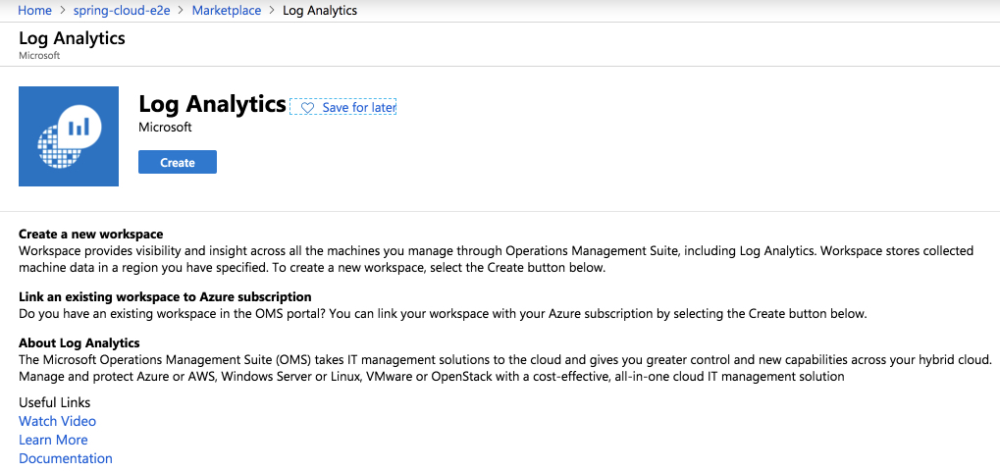
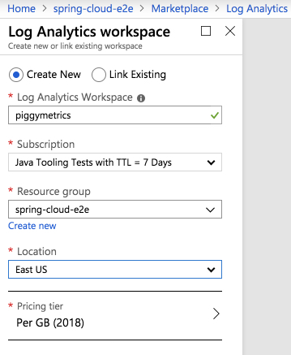

# How to create Log Analytics

This guide walks you through how to create a Log Analytics workspace
in Azure.

## Create a Log Analytics Workspace

Open the Azure Portal and start:

## Resources

- [Create a Log Analytics Workspace using Azure Portal](https://docs.microsoft.com/en-us/azure/azure-monitor/learn/quick-create-workspace)

Go back to [how to use the Azure Spring Cloud service end to end?](https://github.com/azure-samples/azure-spring-cloud)