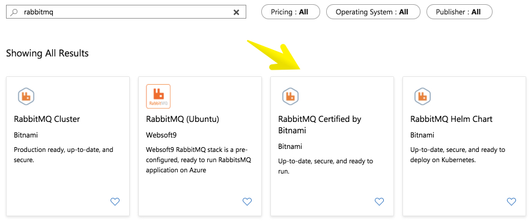
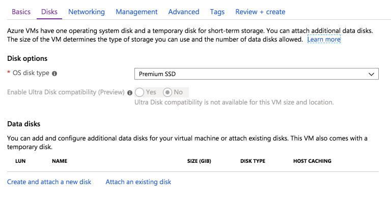
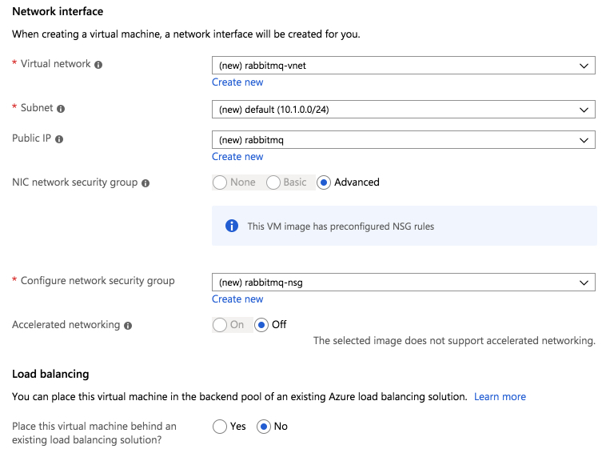
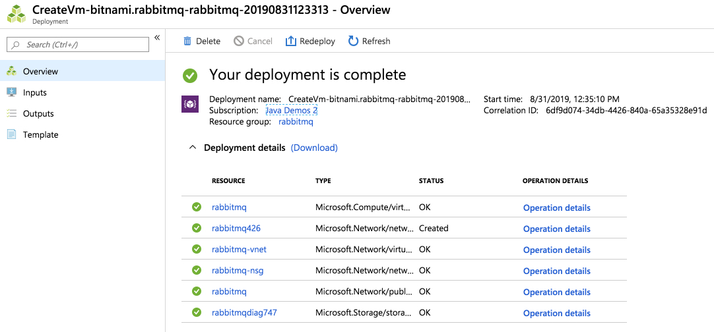
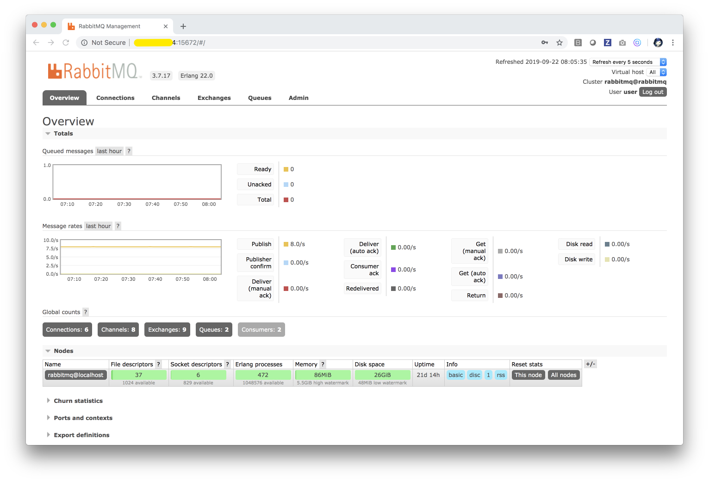

# Create MongoDB and RabbitMQ in Azure

## Create MongoDB
Create an instance of MongoDB:
```bash
# Change directory
cd piggymetrics

# Login into Azure
az login

# Create a Resource Group
az group create --name ${RESOURCE_GROUP} \
    --location ${REGION}

# Create a Cosmos DB account
az cosmosdb create --kind MongoDB \
    --resource-group ${RESOURCE_GROUP} \
    --name ${MONGODB_USER}
  
# Get Cosmos DB connection strings  
az cosmosdb list-connection-strings --resource-group ${RESOURCE_GROUP} \
    --name ${MONGODB_USER} 
```
Cut and paste the primary connection string as MONGODB_URI in setup-env-variables-azure.sh bash file. 

## Create RabbitMQ

See [how to create RabbitMQ ...](./notes/Create-RabbitMQ.md)

Create an instance of Bitnami RabbitMQ Stack For Microsoft Azure, go to 
[https://portal.azure.com/#blade/Microsoft_Azure_Marketplace/MarketplaceOffersBlade/selectedMenuItemId/home/searchQuery/rabbitmq](https://portal.azure.com/#blade/Microsoft_Azure_Marketplace/MarketplaceOffersBlade/selectedMenuItemId/home/searchQuery/rabbitmq) 
and start:










Open RabbitMQ client and administration ports:
```bash
# https://docs.bitnami.com/azure/infrastructure/rabbitmq/get-started/understand-default-config/
az vm open-port --port 5672 --name ${VM_NAME} \
    --resource-group ${RABBITMQ_RESOURCE_GROUP}
az vm open-port --port 15672 --name ${VM_NAME} \
    --resource-group ${RABBITMQ_RESOURCE_GROUP} --priority 1100
```

Find the public IP address of the Linux virtual machine where RabbitMQ is running and 
open an SSH connection:

```bash
# Open an SSH connection, say
ssh selvasingh@${RABBITMQ_HOST}
``` 

You can adjust RabbitMQ to connect with clients from a different machine:
```bash
# https://docs.bitnami.com/azure/infrastructure/rabbitmq/administration/control-services/
sudo /opt/bitnami/ctlscript.sh status

# Stop RabbitMQ
sudo /opt/bitnami/ctlscript.sh stop

# Edit RabbitMQ configurtion file
# https://docs.bitnami.com/azure/infrastructure/rabbitmq/administration/connect-remotely/
# https://github.com/rabbitmq/rabbitmq-server/blob/master/docs/rabbitmq.config.example
sudo nano /opt/bitnami/rabbitmq/etc/rabbitmq/rabbitmq.config

# Particularly, change line 4 from
    {tcp_listeners, [{"127.0.0.1", 5672}, {"::1", 5672}]},
# TO
    {tcp_listeners, [{"0.0.0.0", 5672}, {"::1", 5672}]},

# Start RabbitMQ
sudo /opt/bitnami/ctlscript.sh start
```

You can get your RabbitMQ admin credentials by following the steps in
[https://docs.bitnami.com/azure/faq/get-started/find-credentials/](https://docs.bitnami.com/azure/faq/get-started/find-credentials/)

You should be able to reach the RabbitMQ admin console at:
```bash
open http://${RABBITMQ_HOST}:15672
```



Go back to the main [README](../README.md)